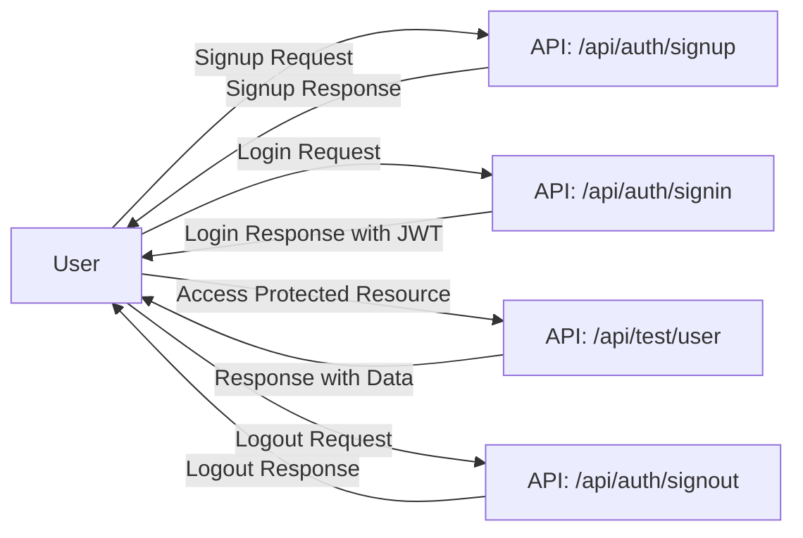
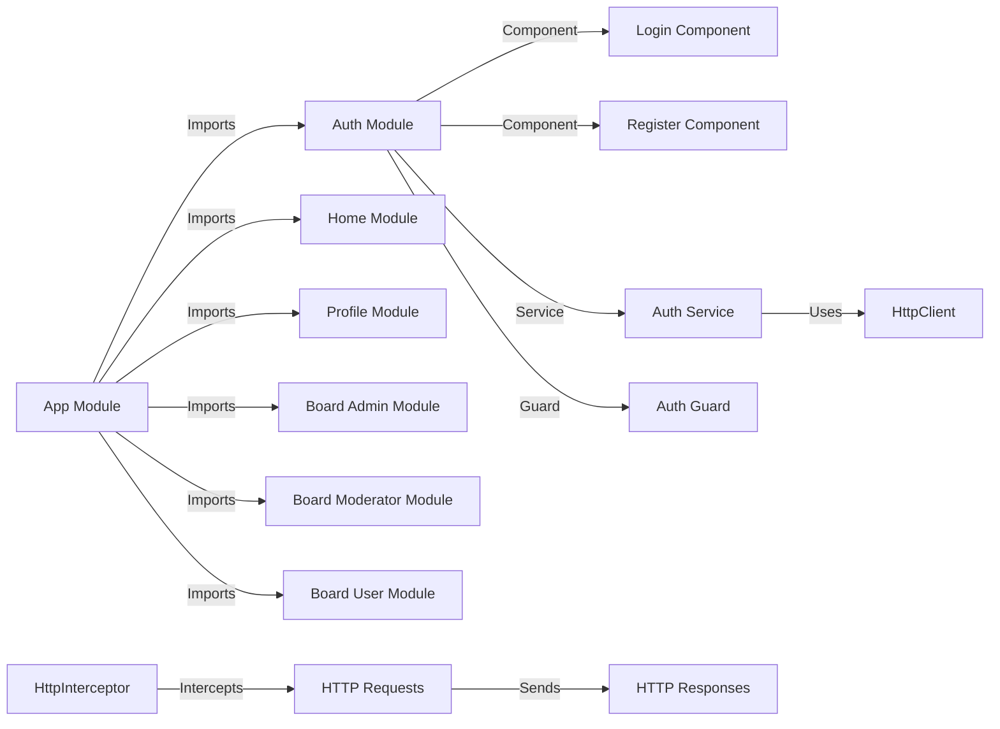

# Angular 16 JWT Authentication & Authorization example with Rest API and RxJS

Build Angular 16 JWT Authentication & Authorization example with Rest Api, HttpOnly Cookie and JWT (including HttpInterceptor, Router & Form Validation).
- JWT Authentication Flow for User Registration (Signup) & User Login
- Project Structure with HttpInterceptor, Router
- Way to implement HttpInterceptor
- How to store JWT token in HttpOnly Cookie
- Creating Login, Signup Components with Form Validation
- Angular Components for accessing protected Resources
- How to add a dynamic Navigation Bar to Angular App
- Working with Browser Session Storage

## Flow for User Registration and User Login
For JWT – Token based Authentication with Rest API, we’re gonna call 2 endpoints:
- POST `api/auth/signup` for User Registration
- POST `api/auth/signin` for User Login
- POST `api/auth/signout` for User Logout

You can take a look at following flow to have an overview of Requests and Responses that Angular 16 JWT Authentication & Authorization Client will make or receive.



## Angular JWT App Diagram with Router and HttpInterceptor




## Execute script to init

ng generate module modules/characters --route characters --module app-routing.module
ng generate service modules/characters/services/character
ng generate component modules/characters/components/character-card
ng generate component modules/characters/components/dynamic-character-loader


Run `ng serve --port 8081` for a dev server. Navigate to `http://localhost:8081/`.


🚀 Implementación de Dynamic Component Loader con Lazy Loading en Angular para la API de Rick and Morty
Vamos a crear un módulo independiente (characters.module.ts) que se cargará de manera Lazy Loading y permitirá cargar personajes de la API de Rick and Morty dinámicamente con Dynamic Component Loader.

📌 Pasos a Seguir
1️⃣ Crear el módulo characters con Lazy Loading
2️⃣ Crear un servicio character.service.ts para consumir la API de Rick and Morty
3️⃣ Implementar un DynamicComponentLoader para cargar los personajes
4️⃣ Configurar rutas para Lazy Loading
5️⃣ Probar la carga dinámica de personajes

1️⃣ Crear el Módulo characters con Lazy Loading
Ejecuta el siguiente comando en tu terminal:

bash
```
ng generate module modules/characters --route characters --module app-routing.module
```
Este comando crea automáticamente:

modules/characters/characters.module.ts


2️⃣ Crear el Servicio para Consumir la API de Rick and Morty
Ejecuta el siguiente comando:

bash
```
ng generate service modules/characters/services/character
```

3️⃣ Implementar DynamicComponentLoader para Cargar los Personajes
📌 Crear el CharacterCardComponent para representar un personaje
Ejecuta:

bash
```
ng generate component modules/characters/components/character-card
```


📌 Implementar el DynamicComponentLoader
Ejecuta:

bash
```
ng generate component modules/characters/components/dynamic-character-loader
```

📌 dynamic-character-loader.component.ts

4️⃣ Configurar la Ruta para Lazy Loading
Verifica que app-routing.module.ts contenga lo siguiente:

typescript
```
const routes: Routes = [
  { path: 'characters', loadChildren: () => import('./modules/characters/characters.module').then(m => m.CharactersModule) },
  { path: '**', redirectTo: '' }
];
```

5️⃣ Probar la Carga Dinámica de Personajes
Edita characters.component.html para usar el cargador dinámico:

html
```
<h2>Lista de Personajes de Rick and Morty</h2>
<app-dynamic-character-loader></app-dynamic-character-loader>
```

✅ Resultado Esperado
1️⃣ Cuando el usuario visita /characters, el módulo se carga dinámicamente gracias a Lazy Loading.
2️⃣ Al hacer clic en "Cargar Personajes", la API de Rick and Morty responde con datos y se generan componentes dinámicos en el DOM para cada personaje.
3️⃣ Cada personaje se muestra en una tarjeta independiente sin necesidad de definir manualmente cada componente en la plantilla.

🔥 Beneficios de Este Enfoque
✅ Lazy Loading: Reduce el tamaño del bundle inicial.
✅ Componentes Dinámicos: Permite cargar datos sin definir manualmente cada componente.
✅ Escalabilidad: Se pueden agregar más APIs y componentes sin modificar la estructura principal.
